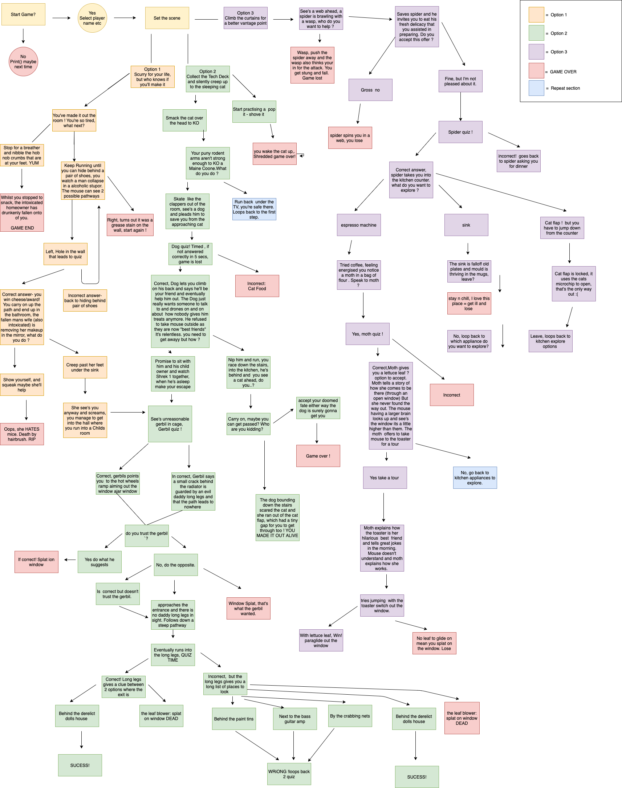
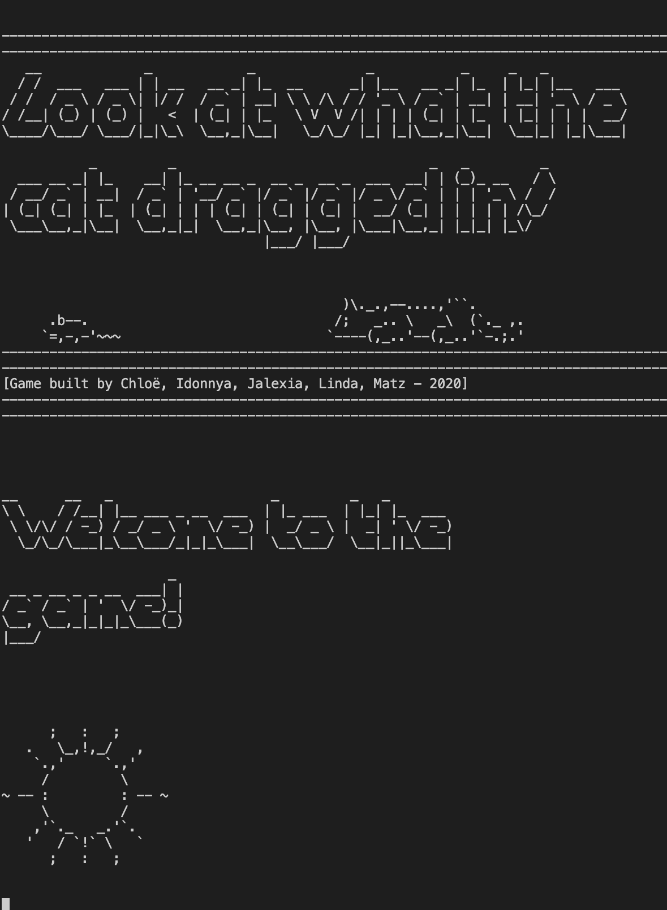
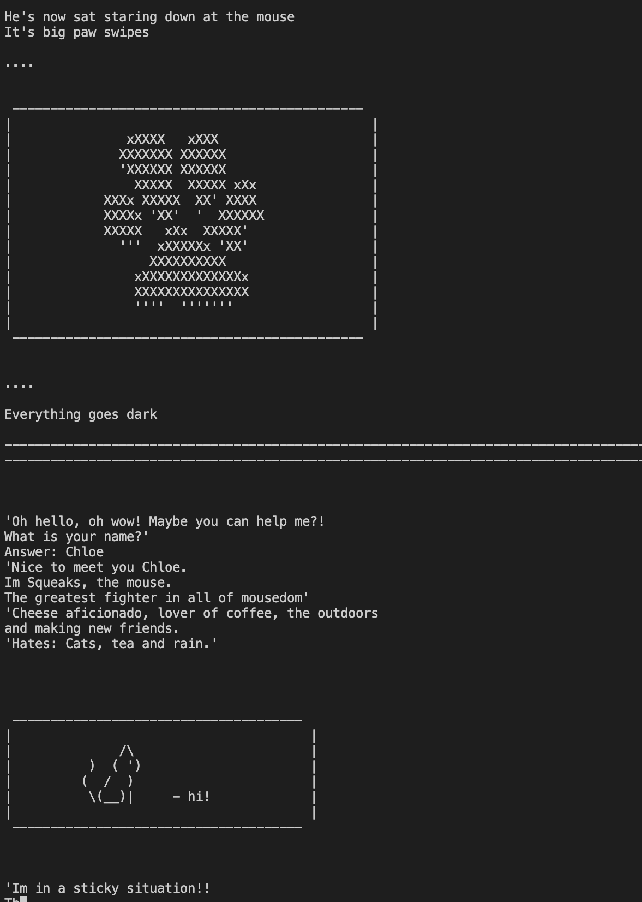

# Look What The Cat Dragged In
A cat and mouse text-based adventure game, written in Python, with added ASCII art, music and sound effects. Created as part of the Code Nation 2 month Bootcamp focusing on Git, HTML, CSS, Python, IT Principles, and Building for accessibility.

- Aimed at kids 11+ 
- To captivate and inspire the imagination 

<br>

--------
<br>

# Tech Stack & Dependencies
- Python
- Pyfiglet
- Emoji
- Random
- Sys
- Playsound
- ASCII Art

<br>

--------
<br>

# Instructions

- Navigate into the inner look_what_the_cat_dragged_in directory - ```cd look_what_the_cat_dragged_in```
- Install python3, using macOS via homebrew - ```brew install python```
- Verify pip is installed - ```pip --version```

## Install the dependencies:
```zsh/bash
pip install pyfiglet emoji random sys playsound
```
## Run the file
```zsh/bash
python3 look_what_the_cat_dragged_in.py 
```

<br>

--------
<br>

# Game Flowchart



<br>

--------
<br>

# Screenshots of the game in action


<br>

--------
<br>


